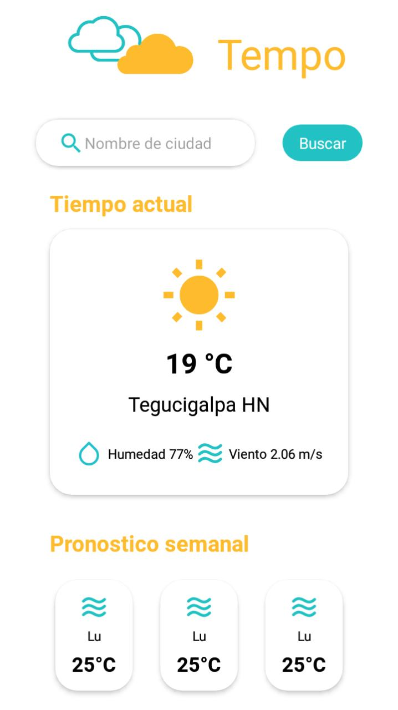

## Tempo App

An application for consult the weather of you're city

**Preview**
<br>


This app is built with React Native v0.63 and Expo

**Instructions**

To start the app you need to install:

- Node.js (version 12 or greater)
- NPM

Then you need to install the Expo Client

```
npm install -g expo-cli
```

Clone the respository

```
git clone https://github.com/abulnes16/tempo.git
```

Install the dependencies

```
npm install
```

And run you're project

```
npm start
```

You can see you're app in you're phone if you install the Expo Client App and scan the QR Code in the Metro Bundler when you run the app. Or if you have installed Android Studio run an AVD of you're choice.

Happy coding!
